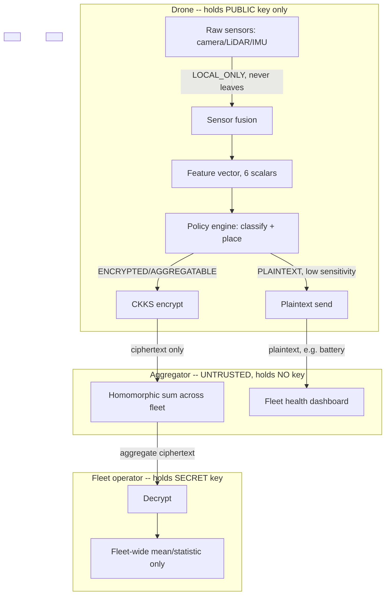

# Data Flow & Trust Boundary Diagram

Trust boundaries (the horizontal `BOUNDARY` rows above): crossing **drone -> aggregator** exposes only
ciphertext bytes and explicitly-plaintext-classified fields (see `lib/policy/classification.ts`);
crossing **aggregator -> operator** is where decryption actually happens, and only on the aggregate, never
on an individual drone's ciphertext. Compare against `docs/threat-model.md` T1-T3 and
`apps/redteam/intercept-demo.ts` for a concrete demonstration of what crosses each boundary.
